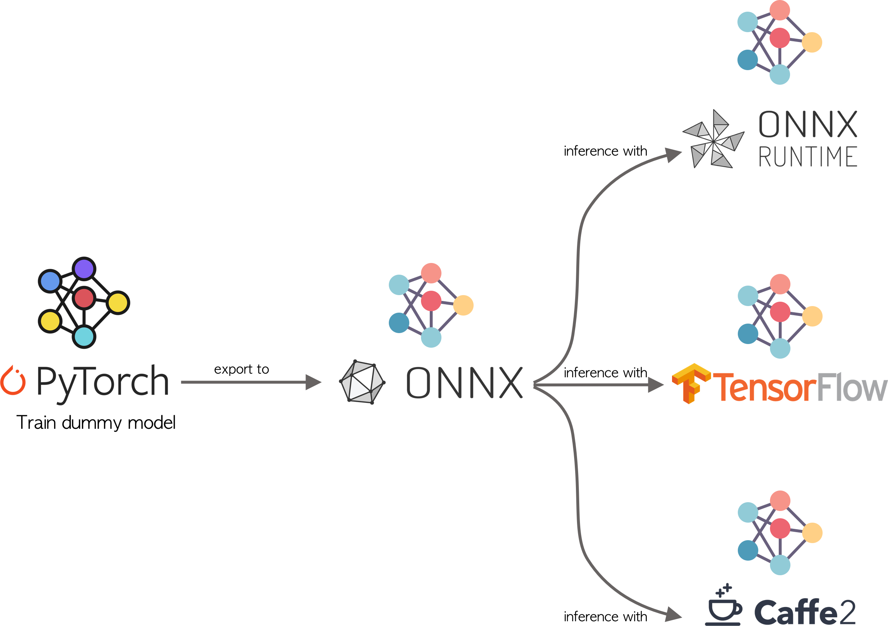

<!-- PROJECT SHIELDS -->
<!--
*** I'm using markdown "reference style" links for readability.
*** Reference links are enclosed in brackets [ ] instead of parentheses ( ).
*** See the bottom of this document for the declaration of the reference variables
*** for contributors-url, forks-url, etc. This is an optional, concise syntax you may use.
*** https://www.markdownguide.org/basic-syntax/#reference-style-links
-->
[![Medium][medium-shield]][medium-url]
[![Twitter][twitter-shield]][twitter-url]
[![Linkedin][linkedin-shield]][linkedin-url]

# ONNX: Preventing Framework Lock in
This repository shows an example of how to use the ONNX standard to interoperate between different frameworks. In this example,we train a model with PyTorch and make predictions with Tensorflow, ONNX Runtime, and Caffe2.

If you want to understand the details about how this model was created, take a look at this very clear and detailed explanation: <a href="https://towardsdatascience.com/onnx-preventing-framework-lock-in-9a798fb34c92?sk=01260e2fb9249831726607b489f7ce32"> ONNX: Preventing Framework Lock in </a>

<!-- TABLE OF CONTENTS -->
## Table of Contents

* [The model](#the-model)
* [Files](#files)
* [How to use](#how-to-use)
* [Contributing](#contributing)
* [Contact](#contact)
* [License](#license)

<!-- the-model -->
## 1. The model
The aim of this example is to demonstrate how to use the ONNX standard to be able to interoperate between different Deep Learning frameworks. The architecture of the example is given as follows, we are going to train a classifier in PyTorch, then we are going to use this trained model to perform inference in Tensorflow, Caffe2 and ONNX Runtime. The architecture of the example is given as follows:

<p align="center">

</p>

<!-- files -->
## 2. Files
* **data**: Here you will find the dataset generator
* **model**: It contains the definition of the PyTorch model as well as the training function
* **onnx**: Here it will be saved the exported Pytorch model as ONNX file
* **src**: It contains the class where each evaluator is called
* **main.py**: This file trigger the entire pipeline (data generation, training, export and load the onnx model, inference)


<!-- how-to-use -->
## 3. How to use
You just need to type

```SH
python main.py
```
however, I recommend you to work with the docker container, just need to build and run the image.

<!-- contributing -->
## 4. Contributing
Feel free to fork the model and add your own suggestiongs.

1. Fork the Project
2. Create your Feature Branch (`git checkout -b feature/YourGreatFeature`)
3. Commit your Changes (`git commit -m 'Add some YourGreatFeature'`)
4. Push to the Branch (`git push origin feature/YourGreatFeature`)
5. Open a Pull Request

<!-- contact -->
## 5. Contact
If you have any question, feel free to reach me out at:
* <a href="https://twitter.com/Fernando_LpzV">Twitter</a>
* <a href="https://medium.com/@fer.neutron">Medium</a>
* <a href="https://www.linkedin.com/in/fernando-lopezvelasco/">Linkedin</a>
* Email: fer.neutron@gmail.com

<!-- license -->
## 6. License
Distributed under the MIT License. See ``LICENSE.md`` for more information.


<!-- MARKDOWN LINKS & IMAGES -->
<!-- https://www.markdownguide.org/basic-syntax/#reference-style-links -->
[medium-shield]: https://img.shields.io/badge/medium-%2312100E.svg?&style=for-the-badge&logo=medium&logoColor=white
[medium-url]: https://medium.com/@fer.neutron
[twitter-shield]: https://img.shields.io/badge/twitter-%231DA1F2.svg?&style=for-the-badge&logo=twitter&logoColor=white
[twitter-url]: https://twitter.com/Fernando_LpzV
[linkedin-shield]: https://img.shields.io/badge/linkedin-%230077B5.svg?&style=for-the-badge&logo=linkedin&logoColor=white
[linkedin-url]: https://www.linkedin.com/in/fernando-lopezvelasco/